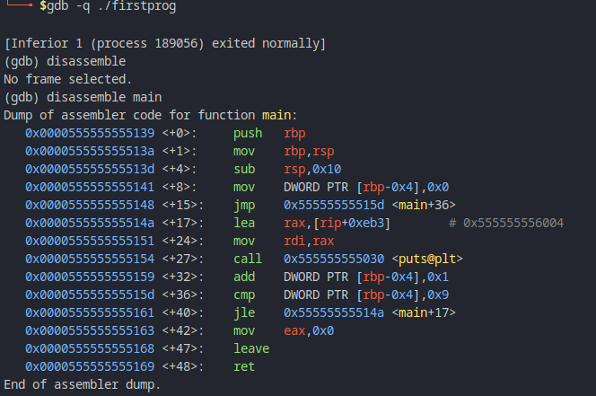
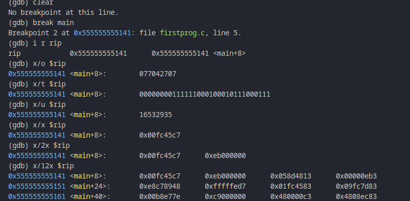

# Introduction

The command required to generate firstprog_asm.txt is:

$ objdump -M intel -D firstprog | grep -A20 main.: > firstprog_asm.txt

For extra familiarity with objdump run 'man objdump'

The second tool I will be using here is the GNU debugger(gdb), which will be useful to step through compiled programs, examine program memory, and view processor registers. To replicate the results contained in firstprog_asm.txt using gdb, run:

$ gdb -q ./firstprog

gdb man page has more details on how on use the GNU debugger.  In this section I will highlight some of the basic commands and their use. PS, I have configured my gdb to use Intel disassembly syntax using the command:

$ echo "set disassembly" > ~/.gdbinit

# Assembly Language

- To generate the assembly code for our compiled binaries, run:

(gdb) disassemble main

- The assembly instructions in Intel syntax generally  follow this style:

   operation <destination> <source>

- The destination and source values will either be a rtegister, a memory address, or a value.

- To understand how computer memory is organized, we will use gdb  to examine the individual registers while pausing  program execution at certain points using gdb.
- Effectively, I am going to include basic gdb commands and then discuss the output.
- Computer memory is like a row of houses on a local street, each with its own address( a row of bytes, each with its own memory address).
- The CPU which is effectively the brain of a computer accesses the memory in a given address to retrieve the machine language instructions that make up the compiled program.

# Registers.

- CPUs/Processors have a special set of variables called registers. Most of the machine language instructions use these registers to read or write data.

- Registers are divided into three categories:
1. General purpose registers
 - EAX, EBX, ECX, EDX - (Accumulator, Base, Counter and Data)
 - They act as temporary variables for the CPU when it is executing machine instructions.

2. Pointers and Indexes.
   - ESP, EBP, ESI, EDI - (Stack Pointer, Base Pointer, Source Index, Destination Index)
   -  The first two point to locations in memory.
   - The latter point to source and destination when data needs to be read or written to.
3. EFLAGS - Consist of bit flags that are used for comparisons and memory segmentations.
- Not fundamentally accessible directly.

4. EIP register is the Instruction Pointer register which points to the current instruction the processor is reading.

# Operations in assembly:
* mov - move from source to destination
* inc- increment
* sub - subtract
* cmp - compare values
* jle(jump if less than or equal to)
* jmp - unconditional jump

1. I have set  a breakpoint at main() that means that program execution will pause before executing any instructions of main.

2. The first three lines of the disassembly of main(shown in the screenshot above) are collectively known as the <em>function prologue</em> and are generated automatically by the compiler to set up memory for the rest of the main() function's local variables.

# Examine command (shorthand x)
- A running program is mostly just a processor and segments of memory. The examination of memory is critical to understanding what's really going on.

- The examine command expects two arguments: the location in memory to examine and how o display that memory.
- The display format of x uses  a shorthand, which is optionally preceded by a count of how many items to examine.
- Here are some common format letters:
* o - Display in octal.
* x - Display in hexadecimal.
* u - Display in unsigned
* t - Display in binary.

- Let's use these in practice to examine the rip register:
  

 - First I have clerared the break point at main using 'clear'. Notice that the breakpoint address is the same as the address of rip(instruction pointer).
 - You can reference registers directly uisng $rip in the case of the instruction pointer.
  
 - I have used the format letters to display the contents of instruction pointer(rip). I have further prepended ab optional number to examine multiple units of tyhe target address.

- The default size of a  single unit is a four-byte unit called a word. The size of the display units for the examine command can be changed by adding a size letter to the end of the format letter.
- The valid size letters are as follows:
  * b - A single byte
  * h - a half word, 2 bytes
  * w - a word, 4 bytes.
  * g - a giant, 8 bytes in size

- The examine command also accepts the format letter i , short for instruction, to display the memory as disassembled assembly language instructions.
- Memory at location RBP can be examined as follows:
  1. Using i r rbp
  2. x/4xb $rbp - 4
  3. x/4xb $rbp - 4
  4. print $rbp - 4
  5. x/4xb $1
  6. x/xw $1
   
- nexti command, shorthand for next instruction prompts the processor to read and execute the instruction at RIP and advance RIP to the next instruction.

